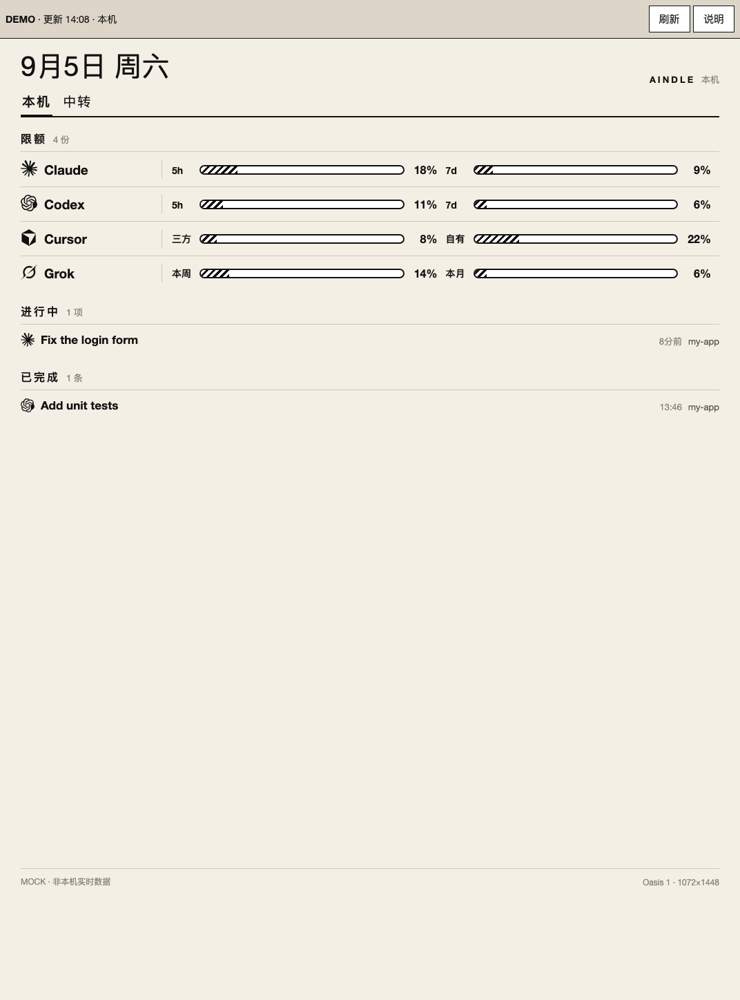
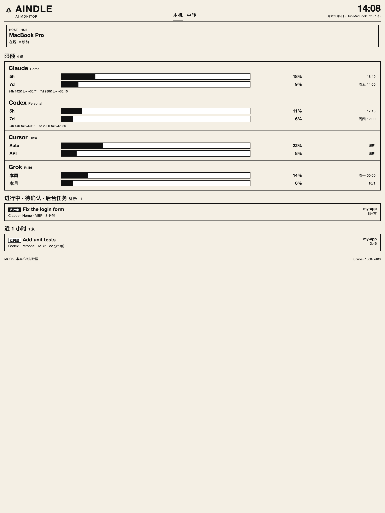

#  Aindle

[English](README.md) | [简体中文](README.zh-CN.md) | [网站](https://aindle.octoooo.com)

[](LICENSE)
[](package.json)

把书桌旁（或已越狱的 Kindle Oasis）做成一块 **私网只读的 AI 工作态势牌**。

它同时看多台机器、多份订阅：Claude Code / Codex / Cursor / Grok Build / Kimi / ZCode（GLM Coding Plan）/ Gemini / Copilot / Kiro / DeepSeek，以及 Sub2API。屏上是 **限额条**、**近 24 小时 / 7 天 token 消耗**，以及 **进行中 / 待确认 / 后台任务**。它不做精力或绩效追踪，不在 Kindle 上审批或回复，也不展示 prompt、回复、绝对路径或 secret。

下面的图全部来自 **mock 数据**。本地执行 `npm run hub` 后，你会看到同一套布局和内置样例。

## 屏上长这样

锁屏看板（Oasis 1，**1072×1448**）。锁屏看；解锁之后还是普通 Kindle。


Hub 看板按小屏 Kindle（Oasis）和大屏 Kindle（Scribe）来排。一台机器、Claude + Codex、一条进行中的任务——第一天最常见的用法。

| Kindle Oasis | Kindle Scribe |
| --- | --- |
|  |  |

三台主机、多份座位：[复杂 Scribe](docs/screenshots/complex-scribe.png) · [复杂 Oasis](docs/screenshots/complex-oasis.png)。不连 Hub 的静态页：`python3 demo/serve.py`。

## 开始使用

需要 Node.js 20+。

```bash
git clone https://github.com/Octo-o-o-o/aindle.git
cd aindle
npm install
npm run hub
```

然后打开：

- 看板：[http://127.0.0.1:8787/monitor.html](http://127.0.0.1:8787/monitor.html)
- 锁屏 HTML：[http://127.0.0.1:8787/eink.html?page=local](http://127.0.0.1:8787/eink.html?page=local)
- 锁屏 PNG：[http://127.0.0.1:8787/dash.png?page=local](http://127.0.0.1:8787/dash.png?page=local)

到这一步已经能看懂界面。Hub 默认灌一份 mock，避免空屏。只想等真 agent 时设 `AINDLE_SEED_MOCK=0`。

### 看自己的机器

另开终端：

```bash
npx aindle init --local
# 编辑 ./config/registry.yaml，只留你真正在用的工具
npx aindle agent --loop 60
```

从 [config/registry.example.yaml](config/registry.example.yaml) 抄。Aindle 不会自动扫遍所有 `~/.claude-*`。填好的 `registry.yaml` 不要提交（已在 gitignore）。

```bash
npx aindle agent --dry-run    # 只打印 JSON，不 POST
npx aindle agent --once
npx aindle agent --mock       # 推一次内置样例
```

| 环境变量 | 含义 |
| --- | --- |
| `AINDLE_HUB_URL` | 默认 `http://127.0.0.1:8787` |
| `AINDLE_TOKEN` | 与 hub 相同（若你设了） |
| `AINDLE_REGISTRY` | YAML 路径 |
| `AINDLE_PORT` / `AINDLE_HOST` | hub 绑定；默认 `8787` / `0.0.0.0` |

### 可选：Kindle Oasis 1

主路径：**`/dash.png` + FBInk**。脚本在 [`kindle/oasis1/`](kindle/oasis1/README.md)。

1. Hub 开在局域网（或 Tailscale）。Kindle 上 **不要** 写 `127.0.0.1`。
2. 把 `kindle/oasis1/` 拷到设备（`/mnt/us/aindle`）。
3. 改 `hub.env`：`HUB=http://192.168.x.x:8787`，以及可选 `TOKEN`。
4. KUAL → 开锁屏监控。锁屏看板。
5. 翻页键只在锁屏时切 **本机 / 进行中 / 中转**。解锁 = 原厂 Kindle。

PNG 正好 **1072×1448**。出图需要 hub 那台机器上有 Chrome / Chromium（不在默认路径就设 `AINDLE_CHROME`）。默认 10 分钟一刷，有进行中任务时 5 分钟。

## 它是什么 / 不是什么

| 是 | 不是 |
| --- | --- |
| 局域网 / Tailscale 上的 **hub + agent** | 公网 SaaS |
| 按订阅画限额（**不要**把三台机器的 5h 条加在一起） | TokenTracker / OctoMonitor 的套壳 |
| 本地 JSONL → 24h / 7d token 和近似美元 | 对账单 |
| **进行中 / 待确认 / 后台任务** | 绩效墙或工时统计 |
| Kindle **锁屏**壁纸 | 解锁后的读书替代品 |

## 怎么拼在一起

```
 MacBook agent          Mac mini agent           Windows agent
  读本地文件 / 限额 API     （常常同时当 hub）        读本地文件 / 限额 API
           \                    |                       /
            +----- POST /api/ingest（脱敏 JSON） ------+
                                |
                           Aindle Hub
                    /snapshot.json  /view.json
                    /monitor.html   /eink.html
                    /dash.png  (1072×1448)
                                |
                         同一私网 / Tailscale
                                |
                         Kindle Oasis 1
                      curl PNG → FBInk
```

| 进程 | 跑在哪 | 可以碰凭证？ | 对外 |
| --- | --- | --- | --- |
| **agent** | 每台开发机 | 可以，只在本机打官方 API | 只向 hub 推已经算好的数字 |
| **hub** | 常开机 | 不存 OAuth | 只读 PNG / 脱敏 JSON |
| **kindle-loop** | Oasis | 不可以 | 只 GET 一张图 |

某台 agent 挂了，上一帧还在，那台标 `stale`，其它机器照常画。

常用地址：`/health`、`/snapshot.json`、`/view.json`、`/monitor.html`、`/eink.html?page=local\|now\|relay`、`/dash.png?page=…`。

屏上 `wait` 第一刀只认 Claude `AskUserQuestion` 和 Codex `request_user_input`，其它工具走年龄档。

## 已接线的数据源

| 工具 | 限额 | 本地 24h/7d token | 会话 |
| --- | --- | --- | --- |
| Claude Code | 官方 5h / 7d / scoped | JSONL | 有 |
| Codex | ChatGPT `wham/usage` | rollout JSONL | 有 |
| Cursor | `usage-summary` | — | chats |
| Grok Build | billing | — | sessions |
| Kimi | usages API | JSONL | 有 |
| ZCode（GLM Coding Plan） | z.ai quota | — | sqlite |
| Gemini | retrieveUserQuota / Antigravity | — | — |
| Copilot（个人） | premium 剩余 | — | — |
| Kiro | CodeWhisperer limits | — | — |
| DeepSeek | 官方余额（`kind: spend`） | — | — |
| GLM 本地 | 无限额条（诚实空白） | JSONL | 有 |
| Sub2API | 全站 / 我的 / 其他人 | 面板花费 | — |

Qwen Code、iFlow **没有配额 API**（只有 429 文本），不做假实现。细则见 [docs/06-data-sources.md](docs/06-data-sources.md)、[docs/13-sub2api.md](docs/13-sub2api.md)。

24h / 7d 美元是 agent 里的 **静态定价表**（`cache_read` ×0.1，`cache_write` ×1.25）。未知模型只计 token。这是体感，不是对账。

## 安全默认值

- 快照 **禁止** `token`、`cookie`、`password`、`secret`、`prompt`、`stack` 这类键。出现即门禁失败。
- 凭证只在本机读（钥匙串、`auth.json`、`keyFile`）。Hub 不存 OAuth。
- 面板密码放在 `0600` 文件里（`passwordFile` / `jwtFile`），不要写进 YAML。
- 设置了 `AINDLE_TOKEN` 之后，JSON / PNG / HTML 都要带 token。
- Hub 绑在局域网 / Tailscale。不要把 `:8787` 暴露到公网。
- `scripts/check-release.sh` 会扫个人主机名和凭据痕迹。

## 包与文档

| 路径 | 职责 |
| --- | --- |
| `packages/core` | `aindle.snapshot.v2` / ingest 合同、合并、视图模型 |
| `packages/hub` | HTTP + `monitor.html` + eink HTML/PNG |
| `packages/agent` | 注册表 → 采集 → POST |
| `kindle/oasis1` | 锁屏循环、KUAL 菜单 |
| `demo/` | 静态 mock（生成物，不要手改 HTML） |
| `site/` | 公开官网 |

| 文件 | 内容 |
| --- | --- |
| [AGENTS.md](AGENTS.md) | 给编程 agent 的短合同 |
| [llms.txt](llms.txt) | 同一份事实，给机器读 |
| [docs/00-index.md](docs/00-index.md) | 阅读顺序 |
| [docs/07-architecture.md](docs/07-architecture.md) | 架构与阶段 |
| [docs/12-testing.md](docs/12-testing.md) | Stage 1 测试指南 |
| [docs/13-sub2api.md](docs/13-sub2api.md) | Sub2API 管理员 / 普通用户 |
| [docs/14-website-and-brand.md](docs/14-website-and-brand.md) | 官网、品牌资源、Cloudflare Pages |
| [demo/README.md](demo/README.md) | Demo 的 URL 参数 |
| [kindle/oasis1/README.md](kindle/oasis1/README.md) | Oasis 1 锁屏操作 |

```bash
npm run check
```

会编译所有包、跑 core / hub / agent 测试、核对生成的 Demo，并跑 Kindle wait 脚本冒烟。

用 mock 重拍 README 截图：

```bash
node scripts/build-demo.mjs
node --import tsx scripts/capture-readme-screenshots.mjs
```

## 本轮仍未做

- 未越狱的锁屏封面方案
- Windows / Mac mini 常驻 agent 安装包
- Oasis 2 / 3 / Scribe 的独立设备档（画板仍按 Oasis 1）
- 官方稳定、零维护的厂商 API——若干限额接口就是各家 CLI 自己在用的未文档化端点。产品要能 `stale`，不要能崩。

## 许可证

[MIT](LICENSE) © 2026 Octo
