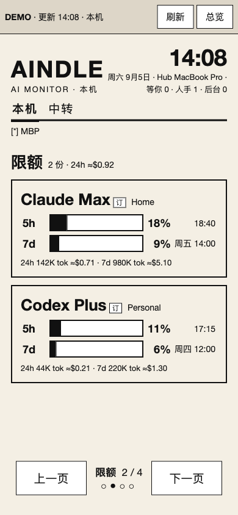
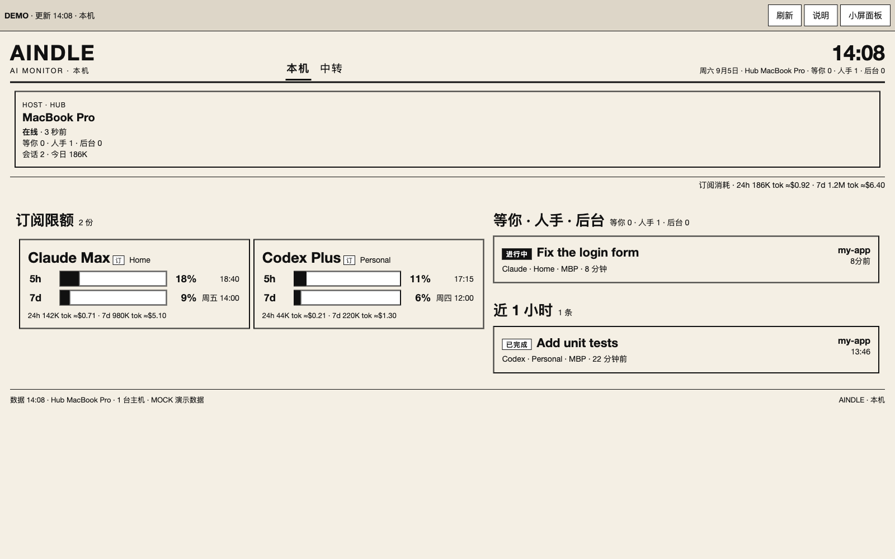
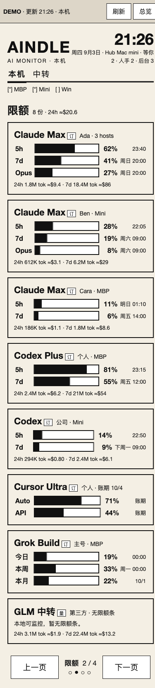
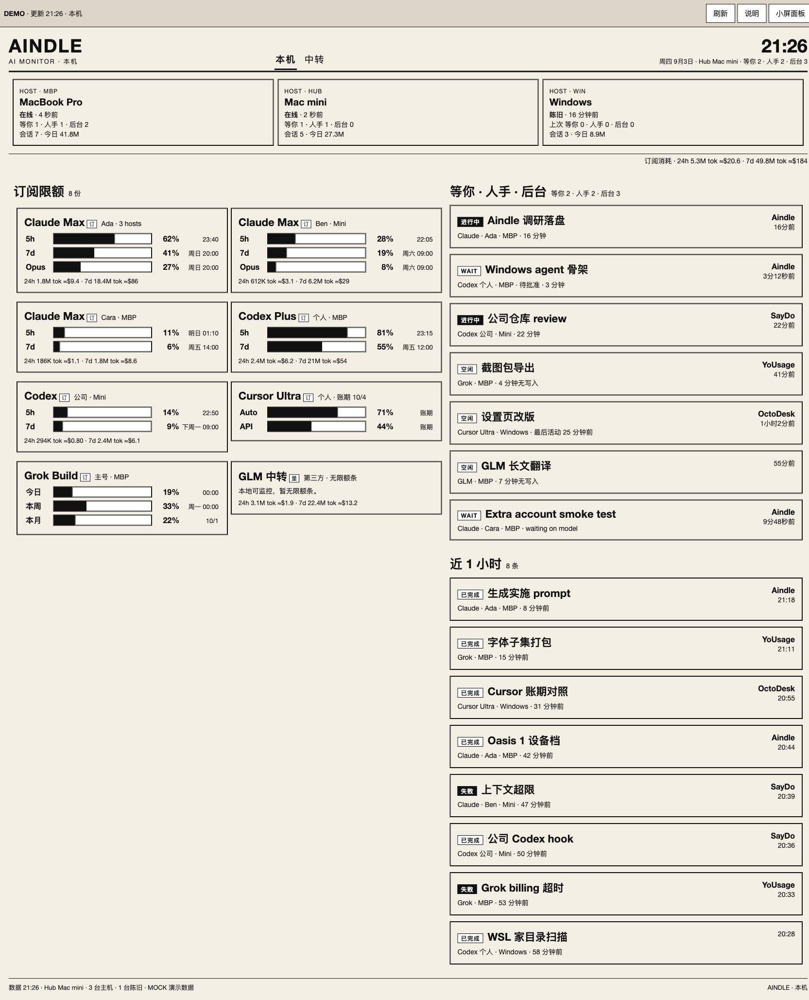
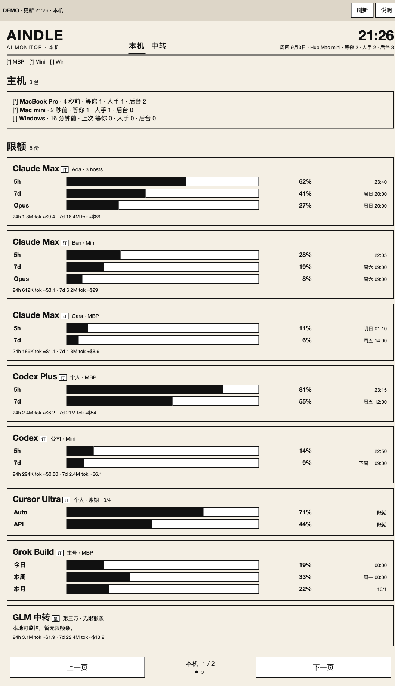

# Aindle

[English](README.md) | [简体中文](README.zh-CN.md)

[](LICENSE)
[](package.json)

把书桌旁（或已越狱的 Kindle Oasis）做成一块 **私网只读的 AI 工作态势牌**。

Aindle 同时看多台机器、多份订阅：Claude Code / Codex / Cursor / Grok Build / Kimi / ZCode（GLM Coding Plan）/ Gemini / Copilot / Kiro / DeepSeek，以及 Sub2API。屏上是 **限额条**、**近 24 小时 / 7 天 token 消耗**，以及 **正在跑 / 等你 / 刚结束** 的任务。它不做精力或绩效追踪，不在 Kindle 上审批或回复，也不展示 prompt、回复、绝对路径或 secret。

下面的图全部来自 **mock 数据**。本机可用 `python3 demo/serve.py` 打开同一套页面。

## 截图

### 简单场景 — 一台 Mac、两份订阅

一台主机，Claude + Codex，一条进行中的任务。这是第一天最常见的用法。

| 小屏（390×844） | 大屏（1600×1000） |
| --- | --- |
|  |  |

### 复杂场景 — 三台主机、多账号

MacBook Pro + Mac mini + 一台已陈旧的 Windows。共享 Claude、公司 Codex、Cursor / Grok / GLM，等你 / 人手 / 后台三口径，以及 Sub2API 中转道。

| 小屏 | 大屏 |
| --- | --- |
|  |  |

### Kindle Oasis 1（1072×1448）

Oasis 1 的主路径是 **PNG + FBInk 锁屏循环**，不是实验浏览器。下图是同一套布局强制成 Kindle 面板模式。



## 它是什么 / 不是什么

| 是 | 不是 |
| --- | --- |
| 局域网 / Tailscale 上的 **hub + agent** | 公网 SaaS |
| 按订阅画限额（**不要**把三台机器的 5h 条加在一起） | TokenTracker / OctoMonitor 的套壳 |
| 本地 JSONL → 24h / 7d token 和近似美元 | 对账单 |
| 「等你 / 人手 / 后台」 | 绩效墙或工时统计 |
| Kindle **锁屏**壁纸 | 解锁后的读书替代品 |

解锁之后还是普通 Kindle：书桌、书库、翻页。看监控 = 按电源键或合上皮套锁屏。

## 怎么拼在一起

```
 MacBook agent          Mac mini agent           Windows agent
  读本地文件 / 限额 API     （常常同时当 hub）        读本地文件 / 限额 API
           \                    |                       /
            +----- POST /api/ingest（脱敏 JSON） ------+
                                |
                           Aindle Hub
                    /snapshot.json  /view.json
                    /monitor.html   /eink.html
                    /dash.png  (1072×1448)
                                |
                         同一私网 / Tailscale
                                |
                         Kindle Oasis 1
                      curl PNG → FBInk
```

三个进程，三种权限：

| 进程 | 跑在哪 | 可以碰凭证？ | 对外 |
| --- | --- | --- | --- |
| **agent** | 每台开发机 | 可以，只在本机打官方 API | 只向 hub 推已经算好的数字 |
| **hub** | 常开机 | 不存 OAuth | 只读 PNG / 脱敏 JSON |
| **kindle-loop** | Oasis | 不可以 | 只 GET 一张图 |

某台 agent 挂了，上一帧还在，那台标 `stale`，其它机器照常画。

## 快速开始

```bash
git clone https://github.com/Octo-o-o-o/aindle.git
cd aindle
npm install
npm run check          # 编译 + 单测 + demo 是否最新
npm run hub            # :8787  Hub + 界面（默认灌一份 mock）
```

另开终端：

```bash
npm run agent -- --mock          # 推一次内置样例
# 或采集真机：
npx aindle init --local          # 写出 ./config/registry.yaml
# 编辑文件，只留你真正在用的工具
npx aindle agent --loop 60
```

然后打开：

- 大屏总览：[http://127.0.0.1:8787/monitor.html?mode=full](http://127.0.0.1:8787/monitor.html?mode=full)
- 小屏面板：[http://127.0.0.1:8787/monitor.html?mode=panels](http://127.0.0.1:8787/monitor.html?mode=panels)
- Oasis 1 预览：[http://127.0.0.1:8787/monitor.html?device=oasis1&kindle=1](http://127.0.0.1:8787/monitor.html?device=oasis1&kindle=1)
- 锁屏 HTML：[http://127.0.0.1:8787/eink.html?page=local](http://127.0.0.1:8787/eink.html?page=local)
- 锁屏 PNG：[http://127.0.0.1:8787/dash.png?page=local](http://127.0.0.1:8787/dash.png?page=local)

Hub 默认带一份 mock，避免空屏。只想等真 agent 时设 `AINDLE_SEED_MOCK=0`。

### 静态 Demo（不连 Hub）

```bash
python3 demo/serve.py
```

- 简单：[http://127.0.0.1:8765/oasis-monitor-simple.html?mode=full](http://127.0.0.1:8765/oasis-monitor-simple.html?mode=full)
- 复杂：[http://127.0.0.1:8765/oasis-monitor.html?mode=full](http://127.0.0.1:8765/oasis-monitor.html?mode=full)

改了 `packages/hub/public/monitor.html` 或 mock JSON 之后重新生成：

```bash
node scripts/build-demo.mjs
```

## 日常怎么用

### 1. Hub

```bash
npx aindle hub
# 或：npm run hub
```

| 环境变量 | 含义 |
| --- | --- |
| `AINDLE_PORT` | 默认 `8787` |
| `AINDLE_HOST` | 默认 `0.0.0.0` |
| `AINDLE_TOKEN` | 设置后需要 `?token=` 或 `Authorization: Bearer` |
| `AINDLE_HUB_ID` / `AINDLE_HUB_LABEL` | hub 自己的名字 |
| `AINDLE_SEED_MOCK` | `0` 表示不灌内置样例 |

常用地址：`/health`、`/snapshot.json`、`/view.json`、`/monitor.html`、`/eink.html?page=local\|now\|relay`、`/dash.png?page=…`。

### 2. Agent

```bash
npx aindle init                 # ~/.config/aindle/registry.yaml
npx aindle init --local         # ./config/registry.yaml
npx aindle agent --dry-run      # 只打印 JSON，不 POST
npx aindle agent --once
npx aindle agent --loop 60
npx aindle agent --mock
```

| 环境变量 | 含义 |
| --- | --- |
| `AINDLE_HUB_URL` | 默认 `http://127.0.0.1:8787` |
| `AINDLE_TOKEN` | 与 hub 相同 |
| `AINDLE_REGISTRY` | YAML 路径 |

从 [config/registry.example.yaml](config/registry.example.yaml) 抄。**只登记你要监控的订阅。** Aindle 不会自动扫遍所有 `~/.claude-*`。填好的 `registry.yaml` 不要提交（已在 gitignore）。

### 3. Monitor 界面

页面是 ES5 + table，Kindle 实验浏览器也能开。真机 Oasis 请走 PNG。

| 参数 | 取值 | 作用 |
| --- | --- | --- |
| `mode` | `panels` / `full` | 小屏翻页 / 大屏总览 |
| `view` | `local` / `relay` | 本机官方座 / Sub2API |
| `scope` | `admin` / `user` / `people` | 中转切片 |
| `page` | `hosts` / `quota` / `now` / `recent` | 面板起始页 |
| `device` | `oasis1` `oasis2` `oasis3` `pw` `basic` `dx` `scribe` | 缩放预设 |
| `kindle` | `1` | Kindle 顶栏（加高条、简化按钮） |
| `refresh` | 秒 | 定时拉 `/view.json`（Demo 下只重绘） |

短边 &lt; 720px → 面板。宽度 ≥ 1600px → 限额卡两列。

屏上三口径是 **等你 · 人手 · 后台**。`wait` 第一刀只认 Claude `AskUserQuestion` 和 Codex `request_user_input`，其它工具走年龄档。

### 4. Kindle Oasis 1

主路径：**`/dash.png` + FBInk**。脚本在 [`kindle/oasis1/`](kindle/oasis1/README.md)。

1. Hub 开在局域网（或 Tailscale）。Kindle 上 **不要** 写 `127.0.0.1`。
2. 把 `kindle/oasis1/` 拷到设备（`/mnt/us/aindle`）。
3. 改 `hub.env`：真实的 `HUB=http://192.168.x.x:8787`，以及可选 `TOKEN`。
4. KUAL → 开锁屏监控。
5. 锁屏看板。翻页键只在锁屏时切 **本机 / 进行中 / 中转**。解锁 = 原厂 Kindle。
6. 默认 10 分钟一刷，有进行中任务时 5 分钟。U 盘模式和循环互斥——推出后再开。

```
http://<局域网IP>:8787/dash.png?page=local
http://<局域网IP>:8787/dash.png?page=now
http://<局域网IP>:8787/dash.png?page=relay
```

PNG 正好 **1072×1448**。出图需要 hub 那台机器上有 Chrome / Chromium（不在默认路径就设 `AINDLE_CHROME`）。

## 已接线的数据源

| 工具 | 限额 | 本地 24h/7d token | 会话 |
| --- | --- | --- | --- |
| Claude Code | 官方 5h / 7d / scoped | JSONL | 有 |
| Codex | ChatGPT `wham/usage` | rollout JSONL | 有 |
| Cursor | `usage-summary` | — | chats |
| Grok Build | billing | — | sessions |
| Kimi | usages API | JSONL | 有 |
| ZCode（GLM Coding Plan） | z.ai quota | — | sqlite |
| Gemini | retrieveUserQuota / Antigravity | — | — |
| Copilot（个人） | premium 剩余 | — | — |
| Kiro | CodeWhisperer limits | — | — |
| DeepSeek | 官方余额（`kind: spend`） | — | — |
| GLM 本地 | 无限额条（诚实空白） | JSONL | 有 |
| Sub2API | 全站 / 我的 / 其他人 | 面板花费 | — |

Qwen Code、iFlow **没有配额 API**（只有 429 文本），不做假实现。细则见 [docs/06-data-sources.md](docs/06-data-sources.md)、[docs/13-sub2api.md](docs/13-sub2api.md)。

24h / 7d 美元是 agent 里的 **静态定价表**（`cache_read` ×0.1，`cache_write` ×1.25）。未知模型只计 token。这是体感，不是对账。7 天无使用且有结构化证据的来源会被藏起；没有证据的来源（Cursor / Grok 等）不会误杀。

## 安全默认值

- 快照 **禁止** `token`、`cookie`、`password`、`secret`、`prompt`、`stack` 这类键。出现即门禁失败。
- 凭证只在本机读（钥匙串、`auth.json`、`keyFile`）。Hub 不存 OAuth。
- 面板密码放在 `0600` 文件里（`passwordFile` / `jwtFile`），不要写进 YAML。
- 设置了 `AINDLE_TOKEN` 之后，JSON / PNG / HTML 都要带 token。
- Hub 绑在局域网 / Tailscale。不要把 `:8787` 暴露到公网。
- `scripts/check-release.sh` 会扫个人主机名和凭据痕迹。

## 包结构

| 路径 | 职责 |
| --- | --- |
| `packages/core` | `aindle.snapshot.v2` / ingest 合同、合并、视图模型 |
| `packages/hub` | HTTP + `monitor.html` + eink HTML/PNG |
| `packages/agent` | 注册表 → 采集 → POST |
| `kindle/oasis1` | 锁屏循环、KUAL 菜单 |
| `demo/` | 静态 mock（生成物，不要手改 HTML） |

## 文档

| 文件 | 内容 |
| --- | --- |
| [docs/00-index.md](docs/00-index.md) | 阅读顺序 |
| [docs/07-architecture.md](docs/07-architecture.md) | 架构与阶段 |
| [docs/12-testing.md](docs/12-testing.md) | Stage 1 测试指南 |
| [docs/13-sub2api.md](docs/13-sub2api.md) | Sub2API 管理员 / 普通用户 |
| [demo/README.md](demo/README.md) | Demo 的 URL 参数 |
| [kindle/oasis1/README.md](kindle/oasis1/README.md) | Oasis 1 锁屏操作 |

```bash
npm run check
```

会编译所有包、跑 core / hub / agent 测试、核对生成的 Demo，并跑 Kindle wait 脚本冒烟。

## 本轮仍未做

- 未越狱的锁屏封面方案
- Windows / Mac mini 常驻 agent 安装包
- Oasis 2 / 3 / Scribe 的独立设备档（画板仍按 Oasis 1）
- 官方稳定、零维护的厂商 API——若干限额接口就是各家 CLI 自己在用的未文档化端点。产品要能 `stale`，不要能崩。

## 许可证

[MIT](LICENSE) © 2026 Octo
